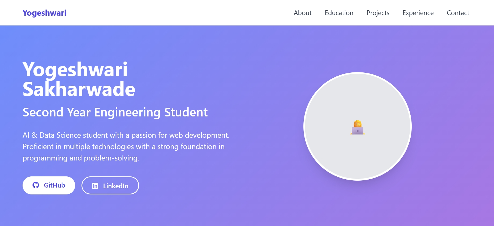
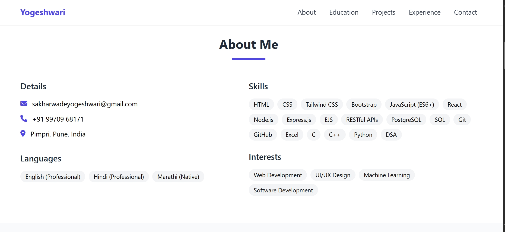
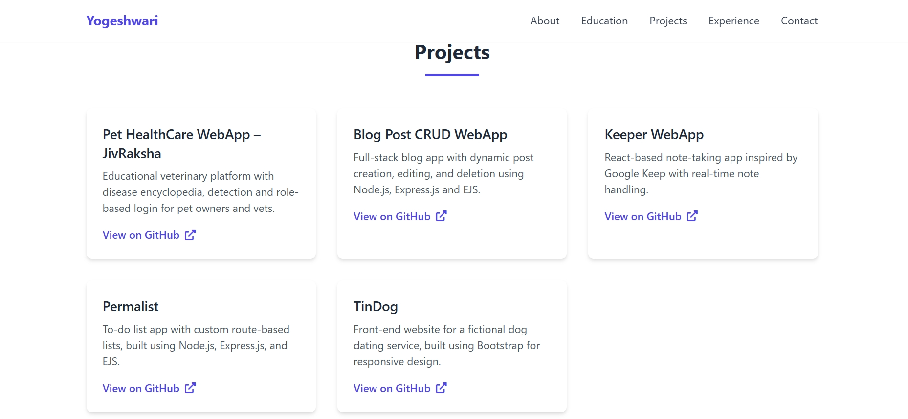

# portfolio-website

#  🌟 Yogeshwari Sakharwade - Portfolio Website

 

A responsive, modern portfolio website showcasing my skills as an AI & Data Science student, built with pure HTML/CSS/JS and Tailwind CSS.

---

## 🚀 Features

* **✅ Interactive UI**  
  Smooth animations and hover effects
* **📱 Fully Responsive**  
  Works perfectly on mobile/tablet/desktop
* **💻 Tech Showcase**  
  Clean categorization of programming skills
* **📚 Project Gallery**  
  GitHub-linked project cards with descriptions
* **📝 Contact Form**  
  Ready-to-connect form (frontend only)

---

## 🛠️ Tech Stack

* **Frontend**  
  
  
  
* **Styling**  
  
* **Icons**  
  

---

## 🖥️ Live Demo

👉 **[View Live Portfolio](https://yogeshwari1703.github.io)**  
*(Upload to GitHub Pages to activate this link)*

---
```
## 🛠️ Project Structure
portfolio-website/
├── index.html # Main website file
├── assets/
│ ├── css/ # Custom styles (if any)
│ └── images/ # Portfolio screenshots
├── README.md # This documentation
```

---

## 🚀 Quick Start

### 1. Clone the Repository
```bash
git clone https://github.com/Yogeshwari1703/portfolio-website.git
cd portfolio-website
```
2. Open in Browser
Just double-click index.html or use:
```
open index.html  # Mac
start index.html # Windows
```
3. Customize (Optional)
Edit directly in:
```
index.html for content

style.css for colors/fonts
```
📸 Screenshots
🏠 Home Section


💻 Skills Section


📚 Projects Section

---
📬 Let's Connect!

💌 Email: sakharwadeyogeshwari@gmail.com

💼 LinkedIn: yogeshwarisakharwade

🐱 GitHub: Yogeshwari1703
